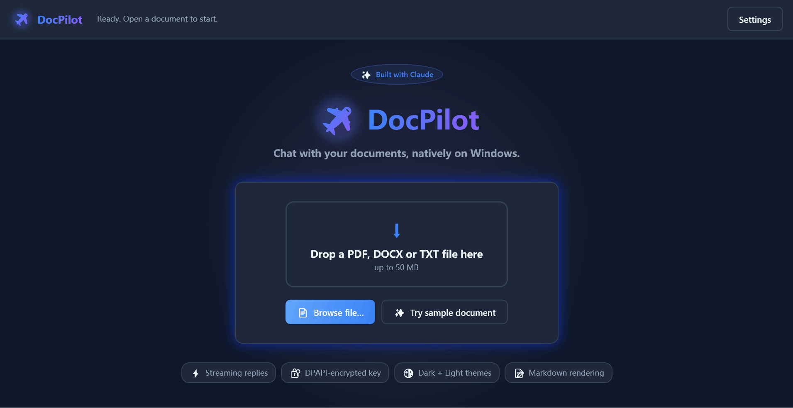
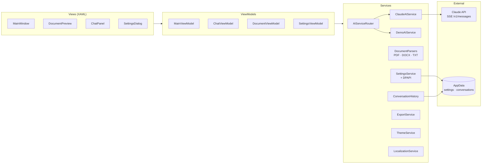

<div align="center">

<h1>
  
  DocPilot
</h1>

### Chat with your documents, natively on Windows.

A streaming, Claude-powered document assistant built as a polished WPF desktop
app. Drop in a PDF, DOCX, or TXT — get a rich Markdown reply the way
Claude.ai delivers it, without ever leaving Windows.

<p>
  
  
  
  
  
  
</p>



</div>

---

## ✨ Why DocPilot?

> **Claude.ai is great on the web. DocPilot brings the same streaming
> document-chat UX to the Windows desktop**, with production-grade MVVM
> engineering underneath.

- 📄 **Drag-and-drop** any PDF / DOCX / TXT (up to 50 MB) and start asking
- ⚡ **Streaming replies** — tokens stream in via `IAsyncEnumerable<string>`
  backed by a tiny SSE parser; Markdown bubble repaints in place
- 🎯 **Quick actions**: _Summarize_, _Translate_, _Ask Questions_
- 💾 **Conversations survive restarts**, saved per-document under `%AppData%`
- 🔐 **DPAPI-encrypted API key** — never on disk in clear text
- 🌗 **Dark + Light themes** swappable at runtime, zero reload
- 🌍 **English + Simplified Chinese** i18n baked in
- 🧪 **Demo Mode** — no API key? The app streams scripted responses so you
  can still see the full UX
- 📤 **Export transcripts** as Markdown or plain text

## 🚀 Try it in 60 seconds

**No API key? No problem.** Clone, build, launch — and hit the ✨ _Try sample
document_ button on the welcome screen. DocPilot's built-in Demo Mode streams
hand-crafted Markdown replies so you can explore every feature before signing
up for Claude.

```powershell
git clone https://github.com/<your-handle>/DocPilot.git
cd DocPilot
dotnet run --project src/DocPilot
# or open DocPilot.sln in Visual Studio and press F5
```

## 🏛 Technical Highlights

Every feature maps to a tellable engineering story:

| Capability | Story |
|---|---|
| **Streaming chat** | `IAsyncEnumerable<string>` consumed with `await foreach`, backed by a bespoke SSE parser on `text/event-stream` |
| **MVVM + DI** | `CommunityToolkit.Mvvm` source generators + `Microsoft.Extensions.Hosting` at the composition root — the same DI model ASP.NET Core uses |
| **Pluggable parsers** | `IDocumentParser` interface with three implementations; `DocumentParserFactory` picks one at runtime. Adding `.epub` takes ~40 lines |
| **Demo Mode** | `AIServiceRouter` transparently swaps the live Claude client for a scripted `DemoAIService` when no key is configured |
| **Runtime theming** | Dark/Light palettes live in separate `ResourceDictionary` files; theme swap replaces a single merged dictionary and ModernWPF's `ThemeManager` propagates it |
| **Encrypted secrets** | The Claude API key is protected with **Windows DPAPI** (current-user scope) before it ever touches disk |
| **Localisation** | Strongly-typed `Strings.resx` with English + Simplified Chinese satellites, switchable at runtime |
| **Test coverage** | xUnit + FluentAssertions across parsers, settings, history, export, and the SSE parser (36 tests) |

## 🗺 Architecture



## 📁 Project Layout

```
DocPilot/
├── src/DocPilot/
│   ├── Models/                 Plain data types
│   ├── ViewModels/             MVVM (CommunityToolkit source generators)
│   ├── Views/                  XAML + code-behind
│   ├── Services/
│   │   ├── AI/                 ClaudeAIService, DemoAIService, router, SSE parser
│   │   ├── Parsing/            IDocumentParser + 3 implementations + factory
│   │   ├── Settings/           DPAPI-protected settings
│   │   ├── History/            Per-document conversation persistence
│   │   ├── Export/             Markdown / plain-text transcript writers
│   │   ├── Theme/              Runtime Dark ↔ Light swap
│   │   ├── Localization/       Runtime EN ↔ zh-CN swap
│   │   └── Dialog/             IDialogService (message-box abstraction)
│   ├── Converters/             XAML IValueConverters
│   ├── Themes/                 DarkTheme / LightTheme / Shared tokens
│   └── Resources/              Strings.resx (en + zh-CN), Styles.xaml, bundled sample doc
└── tests/DocPilot.Tests/       xUnit + FluentAssertions — 36 tests
```

## 🛠 Tech Stack

| Layer | Tech |
|---|---|
| UI | WPF on .NET 8 (`net8.0-windows`), [ModernWPF](https://github.com/Kinnara/ModernWpf) |
| MVVM | [CommunityToolkit.Mvvm](https://learn.microsoft.com/dotnet/communitytoolkit/mvvm/) 8.4 |
| PDF | [PdfPig](https://github.com/UglyToad/PdfPig) |
| DOCX | DocumentFormat.OpenXml |
| Markdown | [Markdig.Wpf](https://github.com/Kryptos-FR/markdig.wpf) |
| HTTP + JSON | `HttpClient` + `System.Text.Json` (no third-party SDK) |
| DI + config | `Microsoft.Extensions.Hosting` 8.x |
| Secrets | Windows DPAPI (`ProtectedData`, current-user scope) |
| Tests | xUnit + FluentAssertions + Moq |

## 🔑 Configuring the Claude API

The app works offline in Demo Mode — no setup required. For live responses:

1. Grab a key at <https://console.anthropic.com/>
2. In DocPilot, click **Settings** → paste the key → hit **Validate** → **Save**
3. The key is encrypted with DPAPI (current-user scope) and written to
   `%AppData%\DocPilot\settings.json` — the plaintext never touches disk

Saved transcripts live alongside it in `%AppData%\DocPilot\conversations\`.

## 🧪 Running Tests

```powershell
dotnet test
```

36 tests across: document parsers, factory resolution, DPAPI round-tripping,
conversation history, export formatting, SSE stream parsing, and Claude
request-body construction.

## 🗺 Roadmap

- [ ] Vector retrieval for long documents (replace the 10,000-character cap)
- [ ] Sidebar conversation history browser
- [ ] Multi-provider abstraction (`IAIService` already fits OpenAI/Gemini)
- [ ] Claude vision support for scanned PDFs
- [ ] MSIX packaging + GitHub Releases auto-update

## 📜 License

MIT — see [LICENSE](LICENSE).

## 🙏 Acknowledgments

Built with: [ModernWPF](https://github.com/Kinnara/ModernWpf) ·
[CommunityToolkit.Mvvm](https://learn.microsoft.com/dotnet/communitytoolkit/mvvm/) ·
[PdfPig](https://github.com/UglyToad/PdfPig) ·
[Markdig.Wpf](https://github.com/Kryptos-FR/markdig.wpf) ·
[Anthropic Claude API](https://www.anthropic.com/).

---

<div align="center">
  <sub>Crafted with ❤ as a portfolio piece. Feedback and stars welcome.</sub>
</div>
